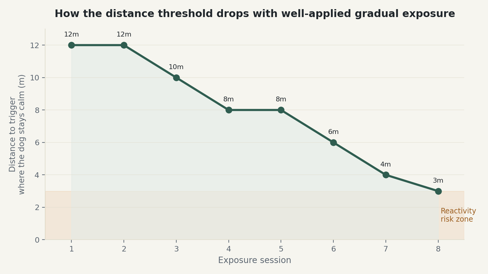

# Bloque 2 · Módulo 1 — Reactividad en la Calle
### Versión avanzada · The Dog Owners Hub — producto premium

*Este módulo trata la reactividad al pasear: ladridos, tirones bruscos o alteración
intensa de tu perro ante otros perros, personas, bicicletas o coches. Incluye
ejercicios, plantillas, un caso práctico y un gráfico de progresión.*

---

## Reactividad no es lo mismo que agresión

La confusión entre ambas es la razón número uno por la que un dueño se asusta más de
la cuenta, o al revés, no le da la importancia que merece. Un perro reactivo ladra,
tira, se pone rígido o gira en círculos al ver el detonante — pero en la inmensa
mayoría de los casos, esa reacción viene del miedo o de la frustración (querer
acercarse y no poder), no de una intención real de hacer daño. Es una reacción
emocional intensa, no un ataque planeado. Esto no la hace menos seria de trabajar —
solo cambia el enfoque: se trabaja la emoción de fondo, no solo el comportamiento
visible.

## El concepto que organiza todo el módulo: el umbral de distancia

Cada perro reactivo tiene una distancia concreta a partir de la cual empieza a
reaccionar — más lejos del detonante, se mantiene tranquilo; más cerca, salta la
reacción. Ese punto se llama umbral, y casi todo el trabajo de este módulo consiste en
ir reduciendo esa distancia poco a poco, sesión a sesión, sin cruzarla nunca de golpe.

El gráfico siguiente ilustra cómo se ve ese progreso en un caso real: el umbral no baja
de forma lineal ni constante — hay sesiones donde se mantiene igual, y eso es
completamente normal, no un estancamiento.

*(El texto dentro de la imagen va siempre en inglés, según acordamos, independientemente del idioma del módulo.)*

**Ejercicio: encuentra el umbral real de tu perro.** En un paseo controlado, acércate
lentamente al tipo de detonante que le afecta (otro perro tranquilo con su dueño, por
ejemplo) y anota la distancia exacta a la que tu perro empieza a mostrar las primeras
señales — no el ladrido, sino lo que viene antes: cuerpo tenso, orejas hacia delante,
dejar de aceptar premios. Esa distancia, no una más corta, es tu punto de partida real.
Empezar más cerca de lo que tu perro puede tolerar es el error más común y el que más
retrasa el progreso.

## El protocolo de exposición gradual, paso a paso

1. Colócate a una distancia donde tu perro nota el detonante pero se mantiene por
   debajo de su umbral — tranquilo, capaz de aceptar premios, sin fijar la mirada de
   forma rígida.
2. En cuanto tu perro mire al detonante y vuelva a mirarte a ti (de forma espontánea o
   guiada con un premio), márcalo y recompénsalo generosamente.
3. Repite varias veces en esa misma distancia durante la sesión. Solo reduce la
   distancia en la siguiente sesión si esta se mantuvo tranquila de principio a fin.
4. Si en algún momento tu perro reacciona (ladra, tira, se pone rígido y no responde a
   premios), aumenta la distancia inmediatamente — no es un fracaso, es información:
   ese punto concreto estaba por encima de lo que podía manejar hoy.

**Plantilla — Registro de sesiones de exposición:**

| Sesión | Detonante | Distancia inicial | ¿Se mantuvo tranquilo? | Distancia para la próxima sesión |
|---|---|---|---|---|
| 1 | Perro tranquilo con dueño | 12m | Sí | 12m (repetir) |
| 2 | Perro tranquilo con dueño | 12m | Sí | 10m |
| 3 | Perro tranquilo con dueño | 10m | Sí | 8m |
| 4 | Perro tranquilo con dueño | 8m | No — ladró una vez | 8m (repetir) |

## Por qué el entorno importa tanto como la técnica

Un perro reactivo se ve afectado por más variables de las que parece: la hora del día
(más o menos densidad de gente/perros), si acaba de comer o está hambriento, si ha
dormido bien, o si ya se ha topado con otro detonante antes en el mismo paseo. Practicar
siempre en el mismo entorno controlado y predecible durante las primeras semanas —
antes de generalizar a paseos normales — reduce estas variables y hace que el progreso
sea mucho más visible.

**Caso práctico.** Un Border Collie de 3 años reacciona con fuerza a otros perros en la
acera de su calle habitual, pero se mantiene tranquilo en un parque más amplio a la
misma distancia. La diferencia no es casualidad: en la acera estrecha no tiene forma de
alejarse si algo le incomoda — el espacio reducido en sí mismo eleva la reactividad,
independientemente del entrenamiento. Cambiar el lugar de práctica a un espacio abierto
durante las primeras semanas, y solo después generalizar a la acera estrecha, acelera
el progreso notablemente frente a insistir en el entorno más difícil desde el
principio.

## El error que retrasa más el progreso: intentar "que se acostumbre" a la fuerza

Exponer a un perro reactivo a su detonante por encima de su umbral, con la idea de que
"cuanto más lo vea, menos le afectará", suele producir el efecto contrario —
sensibiliza en vez de desensibilizar, porque cada exposición mal gestionada refuerza la
asociación negativa en vez de debilitarla. Es, con diferencia, el motivo más común por
el que un dueño dice "ya lo hemos intentado todo y no mejora": casi siempre no es que
el método no funcione, es que las sesiones se han estado haciendo por encima del
umbral real.

## Cuándo esto deja de ser un módulo de autoayuda y pasa a necesitar apoyo profesional

Si hay historial de mordisco (aunque no haya llegado a romper piel), si la reactividad
escala en intensidad en vez de mejorar tras varias semanas de práctica correcta, o si
te sientes físicamente incapaz de manejar a tu perro con seguridad durante un episodio,
es el momento de trabajar con un adiestrador profesional certificado o un veterinario
especializado en comportamiento — presencialmente, no solo con una guía escrita. Este
módulo da el marco y el método, pero un caso ya establecido con historial de mordisco
necesita ojos expertos evaluando en persona.

---

## Cierre del módulo

La reactividad mejora, casi siempre, con el tiempo suficiente y el umbral correcto —
pero "suficiente" en este contexto se mide en semanas y meses, no en sesiones sueltas.
El gráfico de este módulo no es solo una ilustración: es literalmente lo que deberías
ver reflejado en tu propio registro si el proceso se está aplicando bien.

**Próximo módulo del Bloque 2:** Miedos y fobias específicas (ruidos fuertes,
veterinario/peluquero, superficies y situaciones concretas).
